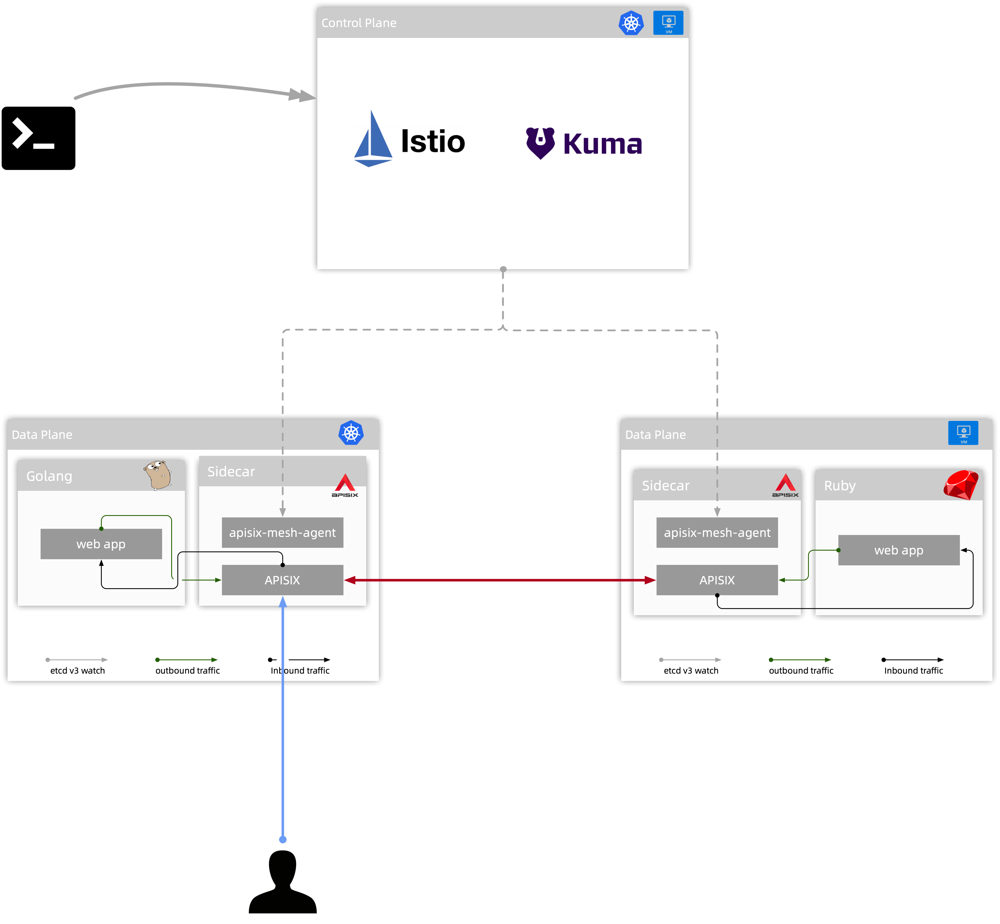

apisix-mesh-agent
=================

Agent of [Apache APISIX](http://apisix.apache.org/) to extend it as a [Service
Mesh](https://www.redhat.com/en/topics/microservices/what-is-a-service-mesh) Sidecar.

Status
------

This project is currently considered as experimental.

Why apisix-mesh-agent
---------------------

APISIX provides rich traffic management features such as load balancing, dynamic upstream, canary release, circuit breaking, authentication, observability, and more.

It's an excellent API Gateway but is not sufficient for Service Mesh, with the help of apisix-mesh-agent, it handles the East-West traffic well.

The Design of APISIX Mesh
-------------------------

See the [Design](./docs/design.md) for the details.

How it Works
-------------

See [How it Works](./docs/how-it-works.md) to learn how apisix-mesh-agent extends Apache APISIX as a Service Mesh sidecar.

The Internal of apisix-mesh-agent
---------------------------------

If you're interested in the internal of apisix-mesh-agent, we recommand you
to read the [the-internal-of-apisix-mesh-agent](./docs/the-internal-of-apisix-mesh-agent.md), it explains each
module's function and responsibility.

Get Involved to Development
---------------------------

Welcome to make contributions, but before you start, please check out
[development.md](./docs/development.md) to learn how to run and debug apisix-mesh-agent
in your own environment.

License
-------

[Apache 2.0 LICENSE](./LICENSE)
