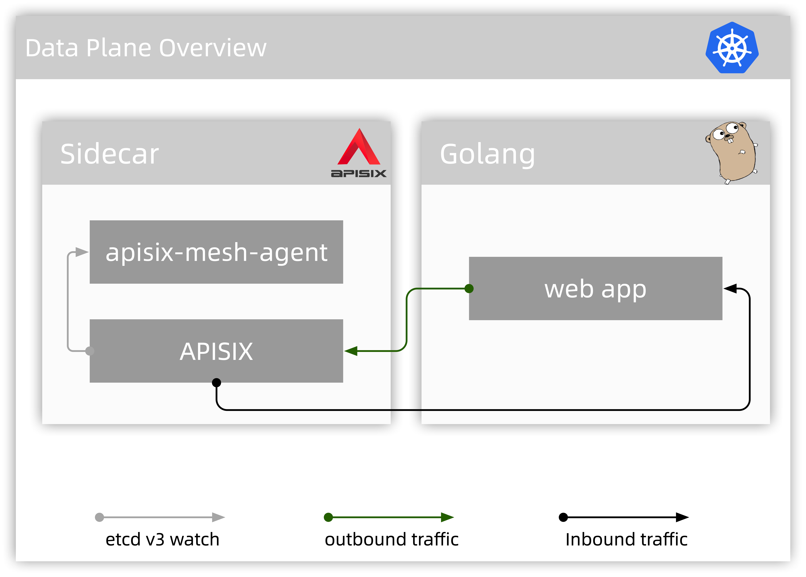

# The Design of APISIX Mesh

This article explains how to implement yet another [Service Mesh](https://www.redhat.com/en/topics/microservices/what-is-a-service-mesh#:~:text=A%20service%20mesh%2C%20like%20the,share%20data%20with%20one%20another.&text=Each%20part%20of%20an%20app,give%20users%20what%20they%20want.) solution by extending [Apache APISIX](http://apisix.apache.org/).

## Status

- Written for the first time on 2021/02/09

## Table of Contents

- [Service Mesh](#service-mesh)
- [Apache APISIX](#apache-apisix)
- [Sidecar in APISIX Mesh](#sidecar-in-apisix-mesh)
- [Communcation Bus Protocol](#communcation-bus-protocol)
- [The Selection of Control Plane](#the-selection-of-control-plane)

## Service Mesh

Service Mesh, is a technology to control how individual application talks with each other, applications get released from it since all essential functions like
routing, service discovery, authenication, authorizatoin and etc are implemented in the Service Mesh solutions,
just like what [Istio](https://istio.io/) and [Linkerd](https://linkerd.io/) does.

Typically, there're two components in a Service Mesh solution, the control plane and data plane.
The former, as the brain of Service Mesh, discovering services from the service registry ([Kubernetes](https://kubernetes.io),
[Consul](https://www.consul.io/) and others), accepting configuration change requests from admin or CI/CD robots and
delivering all configurations to the data plane; The data plane, usually composed by an sidecar process and an application process,
is deployed distributed.

## Apache APISIX

Just like the introduction in the website of Apache APISIX:

> Apache APISIX is a dynamic, real-time, high-performance Cloud-Native API gateway, based on the Nginx library and etcd.
>
> Apache APISIX software provides rich traffic management features such as load balancing, dynamic upstream, canary release, circuit breaking, authentication, observability, and more.

Apache APISIX is an excellent API Gateway solution, but not only for API Gateway, it owns all the necessary characters that a Service Mesh sidecar needs.
It has fantastic resources utilization, flexible routing capabilities, rich plugins and can be extended easily.

## Sidecar in APISIX Mesh

In the APISIX Mesh solution, Apache APISIX is designed as the proxy in the data plane, rather than the whole the sidecar component since Apache APISIX is coupled with [etcd v3 API](https://etcd.io/docs/v3.3.12/rfc/) tightly, while this protocol is not so common,
for the sake of adjusting existing control plane solutions easily, it's not wise to use this protocol as the communication bus protocol between control plane and data plane.

That's why another program (named as apisix-mesh-agent) comes in, it uses a well designed protocol to talk to the control plane, receiving configurations from it, minicking etcd v3 API for the concomitant Apache APISIX.

Resort to this design, what Apache APISIX needs to change is only the value of `etcd.host`, just tweaking to the etcd v3 API address of concomitant apisix-mesh-agent (the blue arrow in the above diagram).

More importantly, apisix mesh agent will set up dozens of iptables rules, to intercept the inbound (pink arrow) and outbound (brown arrow) traffics of the application.

Of course, the above all are not all functions that the apisix mesh agent provides, it also has other auxiliary features such as delivering TLS/SSL certificates, uploading logs, tracing data, metrics for better observability and etc.

## Communcation Bus Protocol

As above mentioned, the etcd v3 API protocol is not a good choice to as the communcation protocol between the data plane and control plane, a well designed, service mesh dedicated protocol is required, and the [Envoy xDS protocol](https://www.envoyproxy.io/docs/envoy/latest/api-docs/xds_protocol) is the best one (at least for now), both due to its rich data structures and its spread and adoption. With the help of xDS protocol, the selection of control plane is not force as long as it also supports the xDS protocol.

## The Selection of Control Plane

To be continued.
