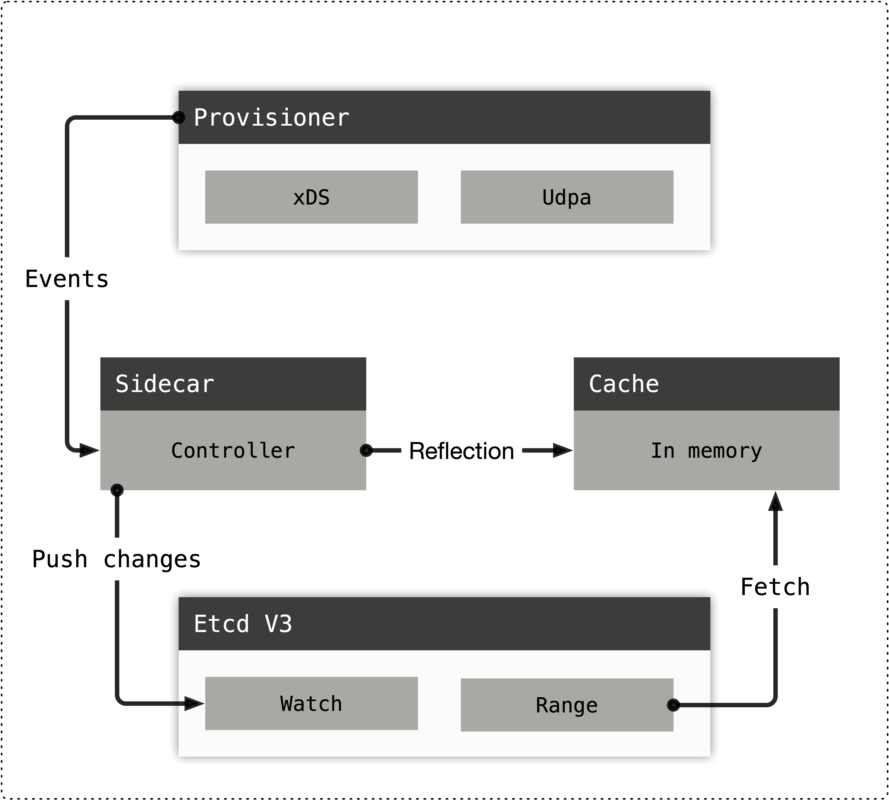

# The Internal of apisix mesh agent

This article explains the internal design of apisix-mesh-agent.

## Table of Contents

- [Overview](#overview)
- [Provisioner](#provisioner)
- [Adaptor](#adaptor)
- [Cache](#cache)
- [Etcd V3](#etcd-v3)

## Overview

The apisix-mesh-agent is modular, each modular exposes interfaces to let others invoke it.
Now it has four modules: [Provisioner](#provisioner), [Adaptor](#adaptor), [Cache](#cache), [Etcd V3](#etcd-v3). The dependency relationships between them are depicted by the following illustration.



## Provisioner

Provisioner provides configurations and transfers them as the type of events. Provisioner is not limited by any kinds of source type.
It depends on the implementations, for instance, there is a [xDS](https://www.envoyproxy.io/docs/envoy/latest/api-docs/xds_protocol) provisioner,
which joints Service Mesh control plane like [Istio](https://istio.io/).

The Provisioner is shown as a Go interface, which is concise.

```go
// Provisioner provisions config event.
// The source type can be xDS or UDPA or whatever anything else.
type Provisioner interface {
    // Channel returns a readonly channel where caller can get events.
    Channel() <-chan []types.Event
    // Run launches the provisioner.
    Run(chan struct{}) error
}
```

The `Channel` method gives a read only channel to let callers watch the configuration changes continuously.
An event represents a configuration change, which contains the event type,
event entity and the tombstone state of the deleted entity.

```go
var (
    // EventAdd represents the add event.
    EventAdd = EventType("add")
    // EventUpdate represents the update event.
    EventUpdate = EventType("update")
    // EventDelete represents the delete event.
    EventDelete = EventType("delete")
)

// Event describes a specific event generated from the provisioner.
type Event struct {
    Type   EventType
    Object interface{}
    // Tombstone is only valid for delete event,
    // in such a case it stands for the final state
    // of the object.
    Tombstone interface{}
}
```

Note basically the `Object` field will be assigned by APISIX resource data structures
like `Route`, `Upstream` and etc. Provisioner is responsible for translating the source-dependent data types to
the APISIX resources with the help of [Adaptor](#adaptor). Therefor, the caller of Provisioner
doesn't care the orignial data types, they just knows the APISIX types.

The design of provisioner also allows people to use other data centers to store
configurations and delivery them to APISIX even if then don't use mesh.

## Adaptor

Adaptor is the abstraction of data translator. It converts data from one type to another. There is not
a superclass definition for it because it depends on the original type. It's used by Provisioner, so
one Provisioner should have a matched Adaptor. Take xDS for example, there is a
`XDSAdaptor` for the xDS version 3.

```go
// Adaptor translates xDS resources like Route, Cluster
// to the equivalent configs in Apache APISIX.
type Adaptor interface {
    // TranslateRouteConfiguration translate a RouteConfiguration to a series APISIX
    // Routes.
    TranslateRouteConfiguration(*routev3.RouteConfiguration) ([]*apisix.Route, error)
    ......
}
```

## Cache

Events generated from Provisioner will be reflected into Cache. Data in Cache are native APISIX resources.

```go
// Cache defines what capabilities a cache solution should provide.
type Cache interface {
    // Route returns the route exclusive cache object.
    Route() Route
    // Upstream returns the upstream exclusive cache object.
    Upstream() Upstream
}

// Route defines the exclusive behaviors for apisix.Route.
type Route interface {
    // Get the apisix.Route by its id. In case of the object not found,
    // ErrObjectNotFound is given.
    Get(string) (*apisix.Route, error)
    // List lists all apisix.Route.
    List() ([]*apisix.Route, error)
    // Insert inserts or updates an apisix.Route object, indexed by its id.
    Insert(*apisix.Route) error
    // Delete deletes the apisix.Route object by the id. In case of object not
    // exist, ErrObjectNotFound is given.
    Delete(string) error
}

// Upstream defines the exclusive behaviors for apisix.Upstream.
type Upstream interface {
    // Get the apisix.Upstream by its id. In case of the object not found,
    // ErrObjectNotFound is given.
    Get(string) (*apisix.Upstream, error)
    // List lists all apisix.Upstream.
    List() ([]*apisix.Upstream, error)
    // Insert creates or updates an apisix.Upstream object, indexed by its id.
    Insert(*apisix.Upstream) error
    // Delete deletes the apisix.Upstream object by the id. In case of object not
    // exist, ErrObjectNotFound is given.
    Delete(string) error
}
```

Data in Cache are used for the Etcd module.

## Etcd V3

The Etcd V3 module implements part of [Etcd V3 API](https://etcd.io/docs/current/learning/api/), It gives Apache APISIX an illusion that the apisix-mesh-agent is just an etcd cluster. Not all features are supported, see [etcdv3-api-mimicking](./etcdv3-api-mimicking.md) for details.